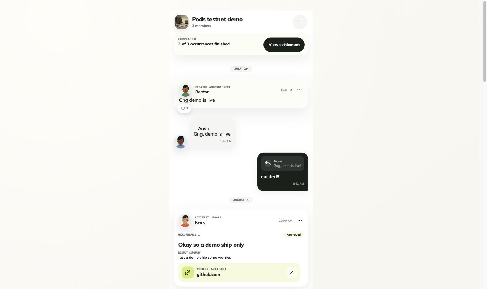
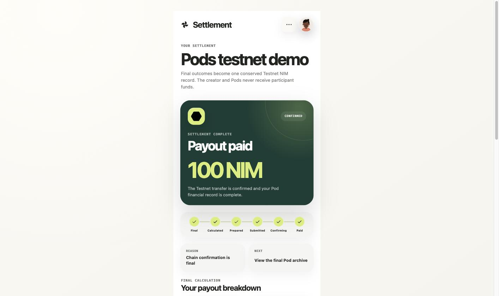

  

<h1 align="center">Pods</h1>

<b>Make showing up feel real.</b>

Activity-led accountability, backed by NIM.

  <a href="https://pods-nimiq-activity.up.railway.app">Live demo</a> ·
  <a href="#how-it-works">How it works</a> ·
  <a href="#proven-on-testnet">Proven on testnet</a> ·

---

Most accountability apps ask you to trust yourself. Pods asks you to put something real behind it.

Create a Pod, lock NIM behind a fixed schedule of proof, and let the stake do the work your willpower won't. Everyone in the room can see who showed up and the payout is decided by that, not by promises.

Every builder knows the gap between the work they actually did and the proof they can show for it. Pods closes that gap: every commitment, every submission, every review is logged, so the credit is undeniably yours.

## How it works

1. **Create or join a Pod**  pick an activity mode (Build & Ship, Fitness, Reading, Study, Practice & Create) and a fixed schedule.
2. **Commit NIM upfront**  funding locks the roster and puts real weight behind the plan.
3. **Submit proof, on schedule**  evidence for each occurrence, reviewed in the open by the creator.
4. **Settle deterministically**  payout is calculated from who showed up. The creator reviews proof but never receives participant funds.

## See it in motion

  
  
  

## Proven on testnet

Not a mockup. Pods has cleared a physical two-wallet verification pass on Nimiq testnet, covering funding, roster lock, three scheduled occurrences, creator review, missed-proof handling, deterministic proportional settlement, and real participant payouts. The complete 0.6 NIM pool was conserved, both participant payouts finalized, nothing went to the creator, and later worker cycles stayed idempotent. The verified core runs live on Railway today.

## Built for

- Builders who want a real execution record, not just a portfolio
- Small groups who need an honest, shared way to keep each other on schedule
- Anyone whose discipline improves when something real is on the line

## Where this is going

Pods is starting narrow, on purpose: a community of builders and shippers first. The direction beyond that is an **execution profile**, not just a builder profile  every commitment and every proof logged, so credit for your work is undeniably yours and your discipline is visible, not just claimed. From there: direct integration with event organizers and hackathons, and timeline support for solo builders and small teams who ship hard and don't have time to manage the socials  so Pods keeps the project in the limelight while they stay heads-down on the build.

## Trust boundary

Pods Testnet is custodial and creator-reviewed  not trustless, not non-custodial, not production-scale. The creator reviews proof but cannot fund or receive participant deposits. Mainnet, disputes, and trustless escrow are on the roadmap, not in this release.

## License
Any content, piece of code, UI or UX design, assets, or documents can not be used, modified, reused, or redistributed by anyone, for any purpose.
